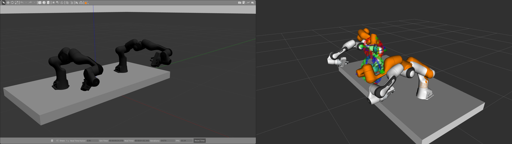

# MoveIt! dual panda robots (Franka Emika)
## Introduction
This is a moveit configuration for controlling 2 Franka Emika robots in gazebo.  

<p align="center">
  
</p>

## Requierments
You need to download the package dual_panda_gazebo for using this package (where the xacro file is). [That package is available on my github](https://github.com/Machine-Jonte/panda_dual_gazebo).
Also, you need to have ros controllers installed. Make sure you have generated the IKFast controllers for the moveit configuration. Otherwise specify the following line in kinematics.yaml
```yaml
kinematics_solver: kdl_kinematics_plugin/KDLKinematicsPlugin
```

## To launch:
Run: 
```
roslaunch panda_dual_gazebo_moveit_config moveit_planning_execution.launch 
```

# How the package was setup
* Used MoveIt! setup assistant, to configure move groups etc.
* Configure controllers (see moveit_controllers.yaml and ros_controllers.yaml)
* Write moveit_planning_execution.launch (meta file for launching everything) and panda_dual_control.launch (launch controllers). Commented line in gazebo.launch to avoid launching the controllers twice.

# Notes
DON'T RUN JOINT STATE PUBLISHER WHEN RUNNING GAZEBO. It will interfere.
